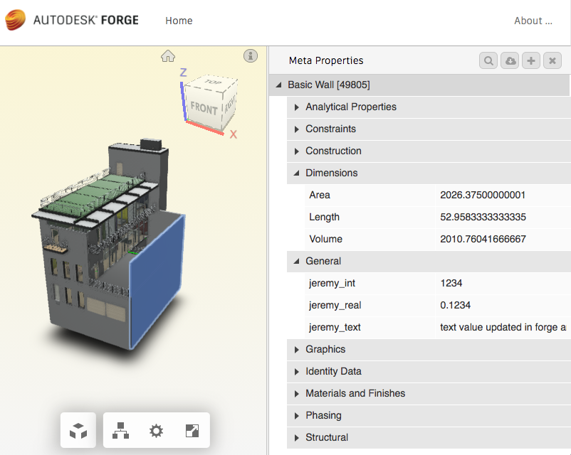
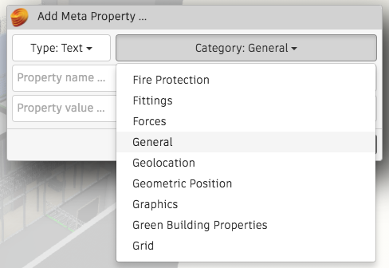

# RvtMetaProp

Revit C# .NET add-in to <u><b>import and store meta properties</b></u> created
in [Philippe Leefsma](https://github.com/leefsmp)'s
[Forge Configurator &ndash; Meta Properties](https://forge-rcdb.autodesk.io/configurator?id=59780eec17d671029c53420e) sample.

Handily enough, RvtMetaProp can also be used as a stand-alone utility to automatically <u><b>create shared parameters and populate their values</b></u> on BIM elements from a spreadsheet, completely independant of the Forge app.

It reads the properties associated with individual BIM elements from a `CSV` or `JSON` file.

If the property corresponds to an existing parameter on a BIM element, its value is updated accordingly.

For a new property, a shared parameter is created.

Here is a [four and a half minute recording](https://youtu.be/I5AvbSrZ3Wk) of this add-in in action:

<center>
<iframe width="480" height="270" src="https://www.youtube.com/embed/I5AvbSrZ3Wk?rel=0" frameborder="0" allowfullscreen></iframe>
</center>


## CSV and JSON Input File Format

The `CSV` and `JSON` input files specify the following data, which correspond to the list Revit information:

- `externalId` &ndash; the Revit database element `UniqueId`
- `component` &ndash; element name and element id (ignored)
- `displayCategory` &ndash; built-in parameter group name under which to display and store a shared parameter
- `categoryId` &ndash; built-in parameter group enumeration value as string
- `displayName` &ndash; meta property name
- `displayValue` &ndash; meta property value
- `metaType` &ndash; meta property data type; for Revit, all but Double, Int and Text are ignored
- `filelink` &ndash; meta property file URL (ignored)
- `filename` &ndash; meta property file name (ignored)
- `link` &ndash; meta property link URL (ignored)

As you can see, some information defined in Forge and specified in the files may be ignored when importing into Revit.

The `CSV` file format looks like this:

```
"externalId","component","displayCategory","categoryId","displayName","displayValue","metaType","filelink","filename","link"
"7df7740a-9736-4a3e-81ec-45e05b0d2ad2-0000c28d","Basic Wall [49805]","General","PG_GENERAL","test_text","this is a text added in forge","Text",,,
"7df7740a-9736-4a3e-81ec-45e05b0d2ad2-0000c28d","Basic Wall [49805]","General","PG_GENERAL","test_real","0.12","Double",,,
"7df7740a-9736-4a3e-81ec-45e05b0d2ad2-0000c28d","Basic Wall [49805]","General","PG_GENERAL","test_int","12","Int",,,
```

The fields are read in an order dependent manner.

The `JSON` file contents are analoguous:

```
[
  {
    "displayCategory": "General",
    "displayValue": "this is a text added in forge",
    "displayName": "test_text",
    "categoryId": "PG_GENERAL",
    "externalId": "7df7740a-9736-4a3e-81ec-45e05b0d2ad2-0000c28d",
    "component": "Basic Wall [49805]",
    "metaType": "Text"
  },
  {
    "displayCategory": "General",
    "displayValue": "0.12",
    "displayName": "test_real",
    "categoryId": "PG_GENERAL",
    "externalId": "7df7740a-9736-4a3e-81ec-45e05b0d2ad2-0000c28d",
    "component": "Basic Wall [49805]",
    "metaType": "Double"
  },
  {
    "displayCategory": "General",
    "displayValue": "12",
    "displayName": "test_int",
    "categoryId": "PG_GENERAL",
    "externalId": "7df7740a-9736-4a3e-81ec-45e05b0d2ad2-0000c28d",
    "component": "Basic Wall [49805]",
    "metaType": "Int"
  }
]
```

You can create a `CSV` or `JSON` input file matching this format to generate new shared parameters in your BIM, either using the Forge meta property editor, or in any other way you like.


## Forge Configurator Sample

A sample meta property editor is included in 
the [online Forge configurator sample](https://forge-rcdb.autodesk.io/configurator):

- Scroll down through the models to *Meta Properties*.
- In the left-hand drop-down menu, select *Office*.
- Click on the *Meta Properties* box.

The [office model](https://forge-rcdb.autodesk.io/configurator?id=59780eec17d671029c53420e) is
displayed, and its properties displayed in a panel on the right-hand side.

You can select any BIM element and see all its properties as well.

The buttons on the top right-hand side of the property panel enable search, export to `CSV` and `JSON`, and adding new properties.

Each property can also be deleted.

The models in this sample are hard-wired.


## Round-Trip Forge Meta Property Editor

To demonstrate round-trip meta property editing on your own Revit BIM model in the Forge Viewer, Philippe implemented
the [Forge meta property editor](http://meta-editor.autodesk.link).



It enables you to upload your own model, add properties to it in the Forge viewer, download the mesta property specifications, and intergrate them into the BIM see file using the RvtMetaProp add-in.

Again, the buttons on the top right-hand side of the property panel enable adding new properties (the plus sign icon) and export to `CSV` and `JSON` (the cloud icon).

RvtMetaProp reads modification into Revit and updates the BIM accordingly.

Retranslation of the updated BIM to Forge completes the round trip.

In order to enable the round trip intact, the meta property data types and group names are restricted to those supported by Revit shared parameters:

- Data types &ndash; restricted to Revit parameter storage types
    - Text
    - Double
    - Int
    

    
- Property group &ndash; restricted to one of the 116 Revit built-in parameter groups
    - Data
    - General
    - Other
    - Text
    - ...
    


The list of Revit built-in parameter group enumeration values and display string labels was generated by
the [BipGroupList add-in](https://github.com/jeremytammik/BipGroupList) and
reformatted into a JavaScript dictionary mapping the enums to the labels using a regular expression.


## Two Options to Add Custom Properties to the Revit BIM

Before implementing RvtMetaProp, I pondered the best way to add custom properties to a Revit BIM.

Basically, there are two fundamentally different approaches, as shown by the following Q &amp; A:

[Q] How can I import updated and added properties into the Revit BIM?

[A] If all you need to do is attach additional information such as your database GUID to a Revit database element, the solution is easy.

You have two options to programmatically attach arbitrary data to building elements in the Revit BIM:
 
- Traditional end user approach: [shared parameters](https://knowledge.autodesk.com/support/revit-products/learn-explore/caas/CloudHelp/cloudhelp/2015/ENU/Revit-Model/files/GUID-E7D12B71-C50D-46D8-886B-8E0C2B285988-htm.html). pros and cons:
    - It comes with a user interface, the standard element property panel.
    - It is visible to Revit, exported to Forge can be used for scheduling, etc.
    - Shared parameters are defined per `Category`, non on a per-`Element` basis.
- New, API specific functionality: [extensible storage](http://thebuildingcoder.typepad.com/blog/about-the-author.html#5.23). pros and cons:
    - No UI, you would have to implement that yourself.
    - The data is equipped with a protection level, is mostly ignored by Revit, therefore cannot be used for scheduling, is not exported to Forge, etc.
    - Extensible storage is assigned on a per-`Element` basis.


## Author

Jeremy Tammik,
[The Building Coder](http://thebuildingcoder.typepad.com),
[ADN](http://www.autodesk.com/adn)
[Open](http://www.autodesk.com/adnopen),
[Autodesk Inc.](http://www.autodesk.com)


## License

This sample is licensed under the terms of the [MIT License](http://opensource.org/licenses/MIT).
Please see the [LICENSE](LICENSE) file for full details.
