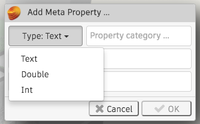

# RvtMetaProp

Revit C# .NET add-in to import and store meta properties created
in [Philippe Leefsma](https://github.com/leefsmp)'s
[Forge Configurator &ndash; Meta Properties](https://forge-rcdb.autodesk.io/configurator?id=59780eec17d671029c53420e) sample.

- Look at
the [online Forge configurator sample](https://forge-rcdb.autodesk.io/configurator).
- Scroll down through the models to *Meta Properties*.
- In the left-hand drop-down menu, select *Office*.
- Click on the *Meta Properties* box.

The office model is displayed, and its properties displayed in a panel on the right-hand side.

You can select any BIM element and see all its properties as well.

The buttons on the right-hand side of the property panel enable search, export to `CSV` and `JSON`, and adding new properties.

Each property can also be deleted.

## Two Options to Add Custom Properties to the Revit BIM

[Q] How can I import updated and added properties into the Revit BIM?

[A] If all you need to do is attach additional information such as your database GUID to a Revit database element, the solution is easy.

You have two options to programmatically attach arbitrary data to building elements in the Revit BIM:
 
- Traditional end user approach: [shared parameters](https://knowledge.autodesk.com/support/revit-products/learn-explore/caas/CloudHelp/cloudhelp/2015/ENU/Revit-Model/files/GUID-E7D12B71-C50D-46D8-886B-8E0C2B285988-htm.html). pros and cons:
    - It comes with a user interface, the standard element property panel.
    - It is visible to Revit, exported to Forge can be used for scheduling, etc.
    - Shared parameters are defined per `Category`, non on a per-`Element` basis.
- New, API specific functionality: [extensible storage](http://thebuildingcoder.typepad.com/blog/about-the-author.html#5.23). pros and cons:
    - No UI, you would have to implement that yourself.
    - The data is equipped with a protection level, is mostly ignored by Revit, therefore cannot be used for scheduling, is not exported to Forge, etc.
    - Extensible storage is assigned on a per-`Element` basis.

## Round-Trip Forge Meta Property Editor

To demonstrate round-trip meta property editing on a Revit BIM model in the Forge Viewer, Philippe implemented
the [Forge meta property editor](http://meta-editor.autodesk.link).

In order to enable the round trip intact, it has to limits the meta property data types and group names to those supported by Revit shared parameters:

- Data types &ndash; restricted to Revit parameter storage types
    - Text
    - Double
    - Int
    

    
- Property group &ndash; restricted to one of the 116 Revit built-in parameter groups
    - Data
    - General
    - Other
    - Text
    - ...
    

The list of Revit built-in parameter group enumeration values and display string labels was generated by
the [BipGroupList add-in](https://github.com/jeremytammik/BipGroupList) and
reformatted into a JavaScript dictionary mapping the enums to the labels using a regular expression.

## Author

Jeremy Tammik,
[The Building Coder](http://thebuildingcoder.typepad.com),
[ADN](http://www.autodesk.com/adn)
[Open](http://www.autodesk.com/adnopen),
[Autodesk Inc.](http://www.autodesk.com)

## License

This sample is licensed under the terms of the [MIT License](http://opensource.org/licenses/MIT).
Please see the [LICENSE](LICENSE) file for full details.
